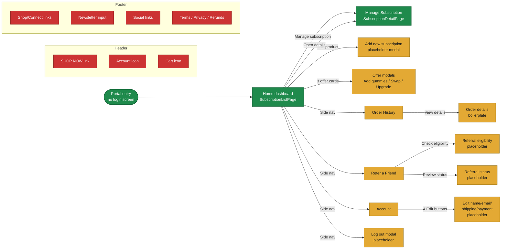
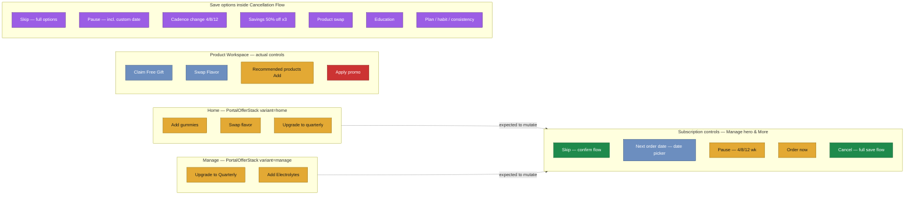
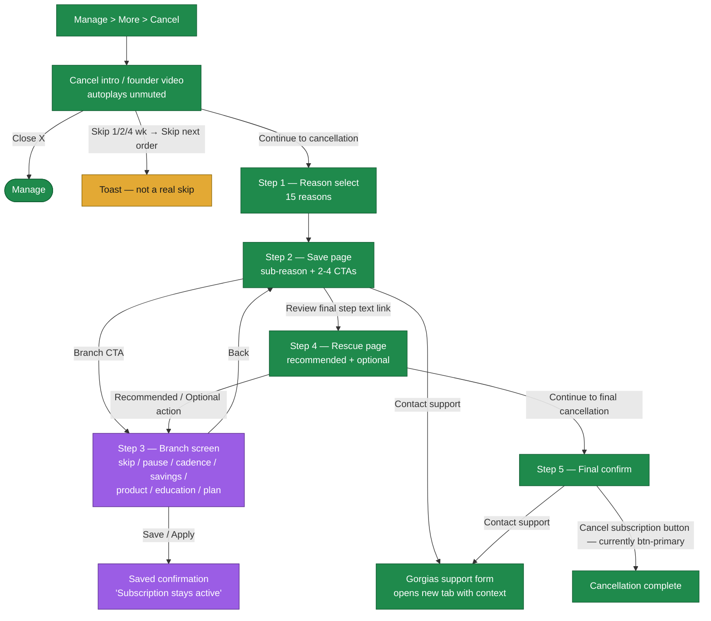
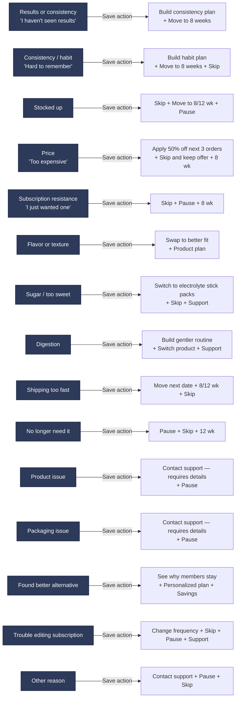
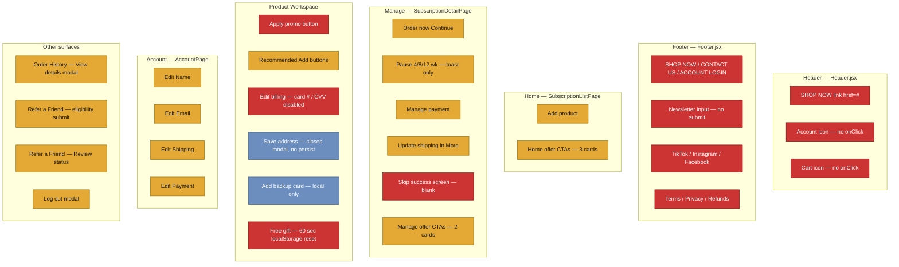
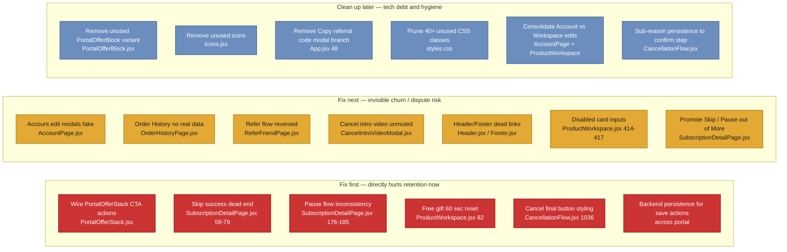

# OMNI Customer Portal — Visual Flow Maps

Visual companion to the audit. Built from the actual files in `src/`.

**Status legend used across every diagram:**

| Label | Meaning |
|---|---|
| `Works` | Real action, persisted in component state |
| `Placeholder` | Opens a modal with boilerplate copy, no action |
| `Dead click` | Element looks interactive, has no handler |
| `Local only` | Mutates state but does not persist beyond reload |
| `Needs backend` | Shows "saved" but does not call a backend |

---

## 1. Full portal experience map

**Notes**
- No real auth — portal boots straight into Home.
- Five real navigation paths in the side rail; Home → Manage is the only one with substantive working flows.
- Three of five side-nav surfaces (Orders, Refer, Account) end in placeholder modals.
- Header and Footer are entirely non-functional — every link is `href="#"`, both icon buttons have no handler.

---

## 2. Manage Subscription flow

```mermaid
flowchart TD
    Mgr[Manage Subscription hero<br/>Every 4 weeks · Next Jun 26]:::ok

    Mgr -->|Back| Home([Home]):::ok
    Mgr -->|Order now| OrderNow[Order now modal<br/>Continue closes only]:::placeholder
    Mgr -->|Next order date| DatePicker[Date picker modal<br/>HTML5 input]:::local
    Mgr -->|Skip| SkipConfirm[Skip this order?<br/>confirm modal]:::ok
    Mgr -->|More| More{More menu}

    More -->|Pause subscription| PauseModal[Pause modal<br/>4/8/12 wk buttons<br/>toast only]:::placeholder
    More -->|Cancel subscription| CancelIntro[Founder video modal<br/>CancelIntroVideoModal]:::ok
    More -->|Manage payment| PayModal[Manage payment<br/>boilerplate]:::placeholder
    More -->|Update shipping| ShipModal[Update shipping<br/>boilerplate]:::placeholder

    SkipConfirm -->|Yes, skip it| SkipSuccess[Skip success screen<br/>BLANK — no CTA]:::needs
    SkipConfirm -->|Keep my order| Mgr

    Mgr --> OfferRow[Member offers — 2 cards<br/>Quarterly · Electrolytes]:::placeholder
    OfferRow -->|Upgrade now / Add to sub| OfferModals[Offer modals<br/>Continue closes only]:::placeholder

    Mgr --> WS[Product Workspace]:::ok
    WS --> Gift[Claim Free Gift<br/>2-step flow]:::local
    WS --> Swap[Swap Flavor<br/>Peach/Watermelon]:::local
    WS --> ShipEdit[Edit shipping form<br/>Save closes only]:::local
    WS --> BillEdit[Edit billing<br/>card # / CVV disabled]:::dead
    WS --> Backup[Add backup card<br/>component state only]:::local
    WS --> Promo[Apply promo<br/>no handler]:::dead
    WS --> Recs[Recommended products<br/>Add → placeholder]:::placeholder

    CancelIntro -->|Continue to cancellation| Cflow([Cancellation Flow<br/>see Diagram 4]):::ok
    CancelIntro -->|Skip next order| CancelSkipToast[Toast — no skip applied]:::placeholder

    classDef ok fill:#1f8a4c,stroke:#0f5a30,color:#fff
    classDef placeholder fill:#e3a934,stroke:#8c6500,color:#1a1a1a
    classDef dead fill:#c33,stroke:#7a0000,color:#fff
    classDef local fill:#6c8ebf,stroke:#2c4a78,color:#fff
    classDef needs fill:#9b5de5,stroke:#5b2d8c,color:#fff
```

**Notes**
- The four hero buttons (Order now / Next order date / Skip / More) all use the same visual weight — Skip and Pause have no hierarchy advantage over the dead Order now.
- Pause is hidden inside More. So is Cancel. Same submenu, equal weight — bad framing.
- Date picker is the only hero button that actually mutates state.
- Skip success screen replaces the full main panel and offers no CTA → return to subscription. Worst dead-end in the app.
- ProductWorkspace contains the most "feels real" surfaces but persistence is local-only.

---

## 3. Offer and retention surface map

**Notes**
- Every customer-facing offer card on Home and Manage is a marketing card that opens a modal — no offer CTA mutates anything.
- The only retention actions outside the cancel funnel that feel real are Skip (full confirm flow, but no backend), the date picker, the swap-flavor flow, and the free-gift flow.
- The richest retention controls are buried *inside* the cancellation flow — visible only to customers who actively try to cancel. Customers who pause/skip outside the flow get a weaker UX.

---

## 4. Cancellation flow visual map

### Cancellation reasons grouped by branch type

**Notes**
- The destructive **Cancel subscription** button on the final confirm screen currently uses `btn-primary` styling. Visually it competes with save CTAs. Should be visually demoted.
- Every reason offers ≥2 save actions before the final-cancel exit ramp.
- Support routes (Gorgias) carry `?context=<reason>` so the team gets the diagnostic.
- Branch screen save messages display "Subscription stays active" but the mutations are not connected to a backend — dispute risk.

---

## 5. Broken or risky paths

**Notes**
- ~30 user-clickable elements are non-terminal. The visual weight of these elements is the same as elements that actually work.
- The Skip success screen is the only flat dead-end — every other broken path at least closes a modal.
- Free Gift 60-second reset is a logic bug, not just a missing handler.

---

## 6. Retention priority heatmap

**Notes**
- Fix-first items are the path between "looks like retention" and "is retention". Most are <1 day of dev.
- Backend persistence (A6) is the single highest dispute/refund liability — a customer who sees "saved" but whose next order still ships will charge back.

---

## 7. Screen-by-screen visual cards

```mermaid
flowchart TB
    S1["
    <b>Home Dashboard</b>
    Purpose: First impression + route to Manage
    Actions: Manage subscription · Add product · Open details · 3 offer cards
    Next: Manage page · placeholder modal · marketing modals
    Status: Works (nav) · Placeholder (offers)
    Files: pages/SubscriptionListPage.jsx · PortalOfferStack.jsx
    Retention risk: HIGH — offers do not act
    "]:::card

    S2["
    <b>Order History</b>
    Purpose: Review past orders
    Actions: View details
    Next: Boilerplate modal
    Status: Placeholder
    Files: pages/OrderHistoryPage.jsx
    Retention risk: MEDIUM — no reorder / invoice / tracking
    "]:::card

    S3["
    <b>Refer a Friend</b>
    Purpose: Drive referrals
    Actions: Submit eligibility form · Review status
    Next: Placeholder modals
    Status: Placeholder (and reversed funnel)
    Files: pages/ReferFriendPage.jsx
    Retention risk: HIGH — asks customer to apply instead of share
    "]:::card

    S4["
    <b>Manage Subscription — Hero</b>
    Purpose: Subscription control surface
    Actions: Order now · Next order date · Skip · More
    Next: Modals · Skip confirm · Cancel intro
    Status: Mixed — Skip + Date work; Order now + More items placeholder
    Files: pages/SubscriptionDetailPage.jsx
    Retention risk: HIGHEST — Skip and Pause buried; Cancel co-equal
    "]:::card

    S5["
    <b>Skip Confirm + Success</b>
    Purpose: Confirm skip then thank customer
    Actions: Yes / Keep
    Next: Skip success screen (blank)
    Status: Confirm Works · Success dead-ends
    Files: pages/SubscriptionDetailPage.jsx 59-79
    Retention risk: HIGH — blank success kills momentum
    "]:::card

    S6["
    <b>Pause Modal</b>
    Purpose: Pause subscription
    Actions: 4 / 8 / 12 weeks
    Next: Toast then close
    Status: Placeholder (toast only)
    Files: pages/SubscriptionDetailPage.jsx 176-185
    Retention risk: HIGHEST — weaker than the in-cancel pause UX
    "]:::card

    S7["
    <b>Member Offer Cards (Home + Manage)</b>
    Purpose: Upsell / cross-sell
    Actions: Click card to open modal
    Next: Marketing modals — Continue closes only
    Status: Placeholder
    Files: components/PortalOfferStack.jsx
    Retention risk: HIGH — entire offer surface inactive
    "]:::card

    S8["
    <b>Product Workspace</b>
    Purpose: Claim gift · Swap flavor · Edit shipping/billing · Promo · Recs
    Actions: Many — see Diagram 2
    Next: Inline confirm or modal
    Status: Mostly Local only · billing card # disabled
    Files: components/ProductWorkspace.jsx
    Retention risk: HIGH — feels real, nothing persists
    "]:::card

    S9["
    <b>Cancel Intro Video Modal</b>
    Purpose: Emotional save before cancel funnel
    Actions: Skip 1/2/4 wk · Continue to cancellation · Close
    Next: Toast or cancellation flow
    Status: Works (UX) · Skip is Placeholder
    Files: components/CancelIntroVideoModal.jsx
    Retention risk: HIGH — autoplays unmuted, blocked on iOS Safari
    "]:::card

    S10["
    <b>Cancellation Flow (5 steps)</b>
    Purpose: Retention funnel + final cancel
    Actions: Reason → Save → Branch → Rescue → Confirm
    Next: Saved screen or Cancellation complete
    Status: Works as a funnel · Needs backend for saves
    Files: components/CancellationFlow.jsx
    Retention risk: STRONGEST surface — but save actions don't persist
    "]:::card

    S11["
    <b>Account</b>
    Purpose: Edit profile and payment
    Actions: 4 Edit buttons
    Next: Boilerplate modals
    Status: Placeholder
    Files: pages/AccountPage.jsx
    Retention risk: MEDIUM — competes with real forms in Workspace
    "]:::card

    S12["
    <b>Header / Footer</b>
    Purpose: Brand + global links
    Actions: Shop / Account / Cart / Social / Terms
    Next: Nothing
    Status: Dead clicks
    Files: components/Header.jsx · components/Footer.jsx
    Retention risk: LOW (trust signal)
    "]:::card

    classDef card fill:#f5f1ea,stroke:#5b3a1f,color:#1a1a1a,font-size:11px
```

**How to use these visuals**

- Diagrams 1–4 are the customer-journey reference for Nick, Kirten, and Levani.
- Diagram 5 is the punch list of broken paths the team needs to either remove or wire up.
- Diagram 6 is the ranked work order for dev.
- Diagram 7 is the screen-by-screen one-pager for everyone else.

All diagrams render natively in GitHub, Notion, Slack canvas, and any Markdown editor with Mermaid enabled.
