# OMNI Customer Portal — Functionality Specification

This document describes **what every screen, button, and flow must actually do** — the
logic behind the UI, not the visuals. The visuals already exist (Figma + the two
builds below). What's missing is the *behavior*: buttons that actually change state,
flows that end in a confirmation, and offers/gifts that follow real business rules.

Read this next to the two live builds:

| Build | URL | Use it for |
|-------|-----|------------|
| **Reference (functional)** | https://omni-customer-portal-delta.vercel.app | The behavior described here is implemented and working. Click through it. |
| Current (to be fixed) | https://omni-customer-portal-rho.vercel.app | Visually close, but the functionality below is missing or wrong. |

> **How to use this doc:** every section states the *rule* (what must happen) and the
> *why*. Don't reproduce screenshots — reproduce the behavior. If a button exists but
> does nothing, it is not done.

---

## 0. Non-negotiable global rules

These apply to **every** page and flow. Most current bugs are violations of one of these.

### R1 — Every action button must complete a real flow
No dead buttons. No bare "notification" toast standing in for a flow. The pattern is
always:

```
[Action button] → Confirmation modal (review what will happen)
               → [Confirm] → processing → Success/"Done" screen (styled)
               → return to the updated page (state has actually changed)
```

Example: pressing **Restart** must restart the subscription. Pressing an **offer** must
open its confirmation, and confirming must show a styled "done" screen and apply the
change. "Upgrade to quarterly" must run its full flow — not just flash a notification.

### R2 — Actions are scoped to ONE subscription, never all
If a customer has two subscriptions, cancelling/reactivating/pausing/skipping **one**
must affect **only that one**. The current build cancels *all* subscriptions at once and
reactivates *all* at once — that is a data-model bug. Every action takes a
`subscriptionId` and mutates only that record.

- Manage page renders **one card per subscription**.
- Each card has its own action row and its own status (`active` / `paused` / `inactive`).
- A global "cancel all" does not exist.

### R3 — Retention hierarchy: the "stay" button is always the highlighted one
Anywhere the customer is choosing between *keeping/saving* the subscription and
*continuing to cancel*, the **save action is the primary highlighted button** and the
**cancel/continue action is a de-emphasized text link or outline button**.

Example: on a cancellation save screen offering "Skip next order", the **Skip** button is
highlighted (primary); "Continue cancellation" is a small secondary link. Apply this to
**every** flow that has a keep-vs-leave decision.

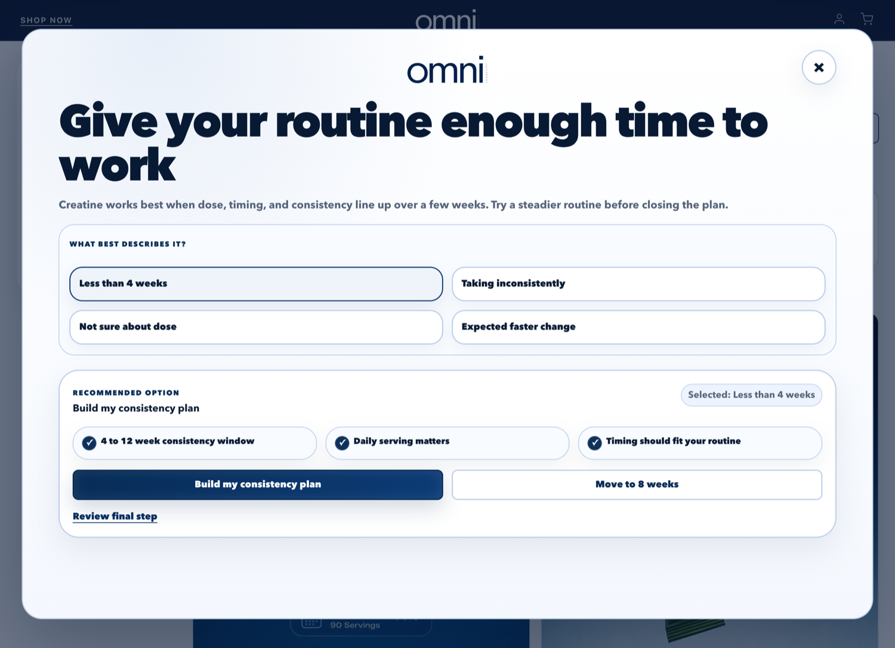
*R3 in practice: the retention action ("Build my consistency plan") is the solid primary
button; "Review final step" (continue to cancel) is a small text link. The eye lands on staying.*

### R4 — State drives the UI, from one source of truth
There are exactly three subscription states. The whole portal reads from a single status
value per subscription and re-renders when it changes:

| State | Meaning | Primary CTA shown |
|-------|---------|-------------------|
| `active` | Normal, orders shipping | Manage / Order now / Skip / Pause / Cancel |
| `paused` | Temporarily halted, resumes on a date | **Resume subscription** |
| `inactive` | Cancelled / lapsed | **Restart subscription** (winback) |

A customer must never see Pause/Skip/Cancel/"Order now"/"Next order" while `inactive`.
A customer must never see "Restart" while `active`.

### R5 — Offers and gifts are segment-gated
Offers are not shown to everyone. Each offer has a **visibility rule** based on the
customer's current plan/history (see §7). If the rule fails, the offer is hidden — not
greyed out.

---

## 1. Subscription states & transitions

The reference build implements this exactly. Every transition below is a real action the
customer can trigger, and each ends in a styled confirmation.

```
            ┌───────── Restart flow (choose product/flavor/cadence → confirm) ─────────┐
            │                                                                            ▼
        INACTIVE  ◀────── Cancel flow (reasons → save attempt → final confirm) ────── ACTIVE
            ▲                                                                            │
            │                                                                     Pause flow
            │                                                                            ▼
            └───────────────────────────── (from paused, Cancel) ───────────────────  PAUSED
                                                                                         │
                                                                    Resume ──────────────┘  → ACTIVE
```

| Transition | Trigger | Result | Ends with |
|-----------|---------|--------|-----------|
| inactive → active | Restart flow confirmed | Subscription reactivated (that one) | Styled "You're back" success screen |
| active → paused | Pause modal or cancel-flow "Pause" save | Deliveries halted, resume date computed | "Paused — resumes {date}" confirmation |
| paused → active | Resume subscription | Deliveries resume | "Resumed" toast + updated page |
| active → inactive | Cancel flow **final confirm** | Subscription cancelled (that one) | "Your subscription has been cancelled" screen |

**Resume date logic (pause):** `resumeDate = today + N weeks` from the chosen pause
length (4/8/12 weeks etc.). Show it everywhere the paused state appears.

The same page, three states — layout stays identical, content and CTAs swap:

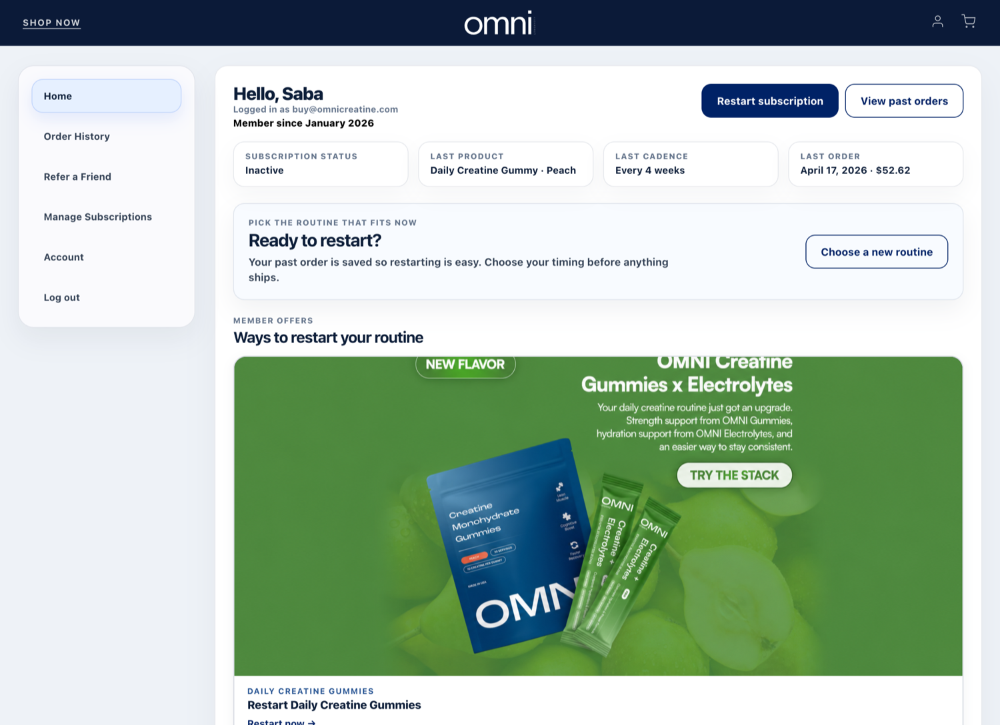
*`inactive`: status "Inactive", last product/cadence/order, primary CTA is **Restart subscription**.*

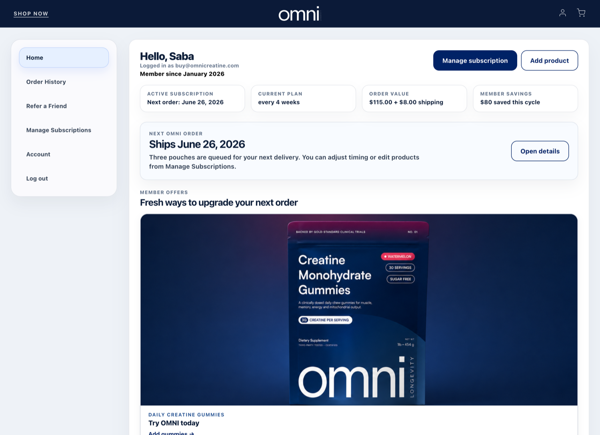
*`active`: next order date, plan, order value, savings; primary CTA is **Manage subscription**.*

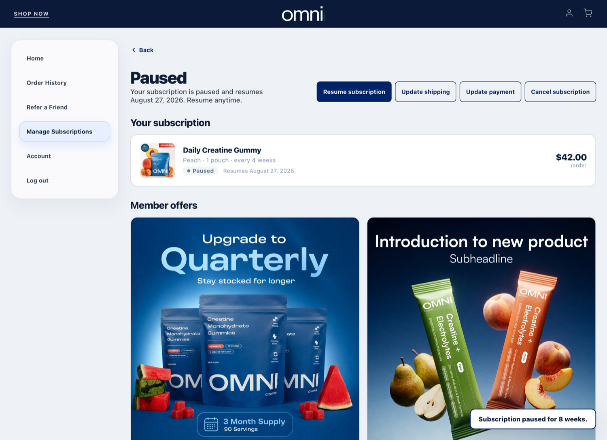
*`paused`: "Paused" title + resume date, muted badge, primary CTA is **Resume subscription**.*

---

## 2. Home page

**Purpose:** account overview + entry points. Same layout in all states; content swaps.

| Element | active | paused | inactive |
|--------|--------|--------|----------|
| Quick actions | Manage subscription · Add product | **Resume subscription** · Manage | **Restart subscription** · View past orders |
| Summary strip (4 cells) | Next order · Plan · Order value · Savings | **Paused** · Resumes {date} · Plan · Order value | **Inactive** · Last product · Last cadence · Last order |
| Command card | "Ships {date}" + Open details | "Resumes {date}" + Resume now | "Ready to restart?" + Choose a new routine |
| Offers | Upsell offers (§7) | Upsell offers | Winback/restart offers |

**Logic:** the strip and cards read from the live subscription record. If the customer
has multiple subscriptions, show a compact list/among cards — each with its own status —
rather than collapsing them into one summary.

---

## 3. Manage subscription page (active)

One card per subscription. For each active subscription the action row is:

| Button | What it must do |
|--------|-----------------|
| **Order now** | Confirmation modal ("charge saved payment, ship queued items now") → confirm → success. |
| **Next order date** | Date picker modal → save → "Next order date updated" + the date on the page changes. |
| **Skip** | "Skip this order?" confirm → shows the exact date being skipped → confirm → skip-success screen; subscription stays active. |
| **Pause** | Opens Pause flow (§5). |
| **Cancel** | Opens Cancel flow (§6). |

Product card shows: product name, flavor · quantity · cadence, **Active** badge, "Next
{date}", price/order. All values come from that subscription's record.

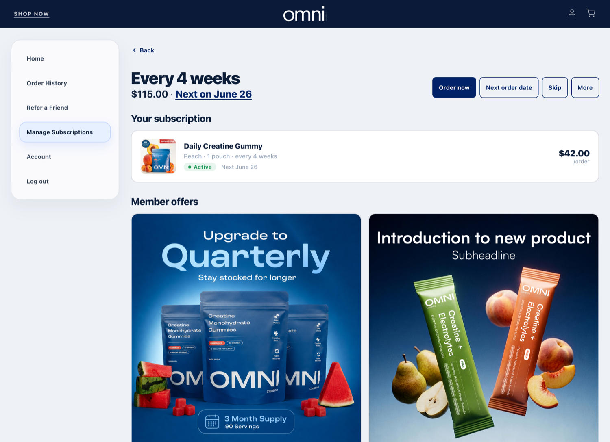
*Active manage page: action row (Order now · Next order date · Skip · More), product card
with Active badge, and member offers below.*

### 3.1 Free gift — one-time, segment-specific  *(fixes Levani #3)*

The "Claim Free Gift" card sits in the manage workspace. It must behave as a **one-time
gift**, never as a recurring subscription line.

- Tapping the card opens a modal with two paths:
  - **Ship with my next order** → confirm → the one-time gift is attached to the next
    shipment → success toast ("locked in, ships with your next order").
  - **Send to a friend** → opens a **shipping-address form** (name, address, city, state,
    zip, contact) → send → styled "gift confirmed, we'll get it to {friend}" overlay.
- After claiming, the gift is **locked** (the card hides / can't be re-claimed) so it can't
  become recurring or be claimed twice.
- **Which gift** is shown is segment-driven (customers who did XYZ → free peach; customers
  who did XY → a different one-time gift). This is a display/eligibility rule per customer.

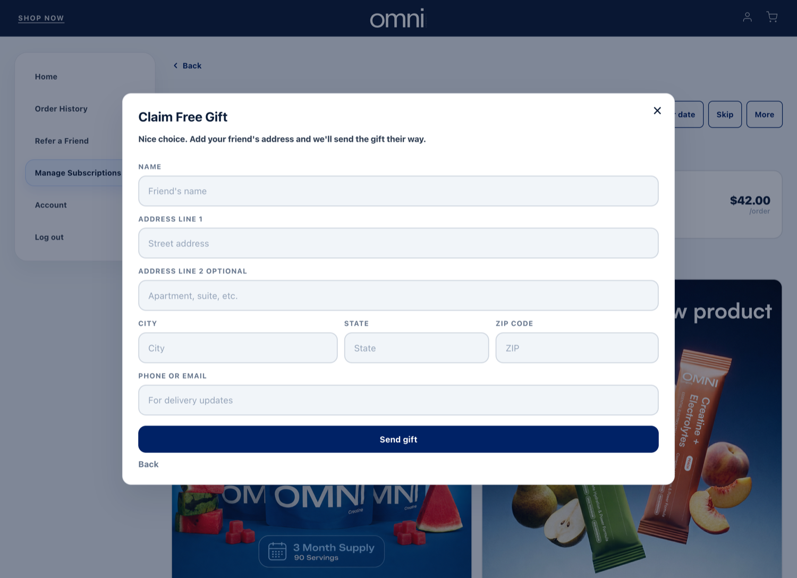
*"Send to a friend" opens an address form; the gift ships to that address as a one-time item.*

### 3.2 Swap flavor

- Select Peach or Watermelon → **Confirm swap** → review modal (shows the new flavor) →
  confirm → applies to the **next order only**; product and frequency stay the same.

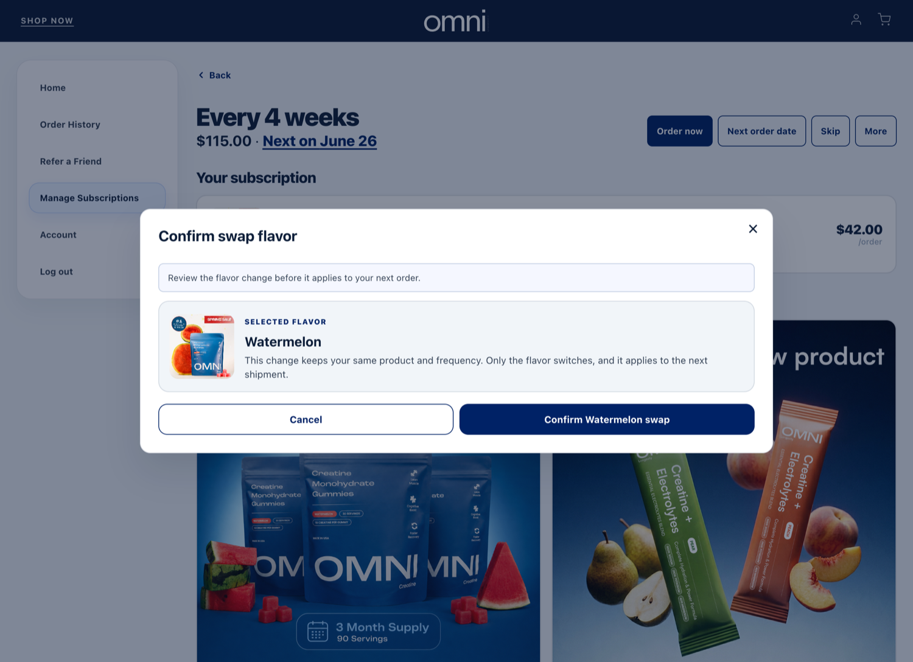
*Flavor swap always routes through a confirmation before it applies to the next order.*

### 3.3 Recommended products — "You might also like"

- Each recommended product has a **variant selector** (flavor / quantity) and price.
- **Add** → "Add to next order" confirmation → the selected variant is added to the
  upcoming shipment (flavor + final pricing confirmed before checkout).

### 3.4 Shipping / billing / backup card

- **Edit shipping** → address form → save → reflected on the page.
- **Edit billing** → payment form → save (connects to the payment provider in production).
- **Add backup card** → card form → stored as a fallback, charged only if the primary card
  fails.

### 3.5 Order summary

- Shows **subtotal + shipping + total** for the next order.
- **Coupon / promo field** with Apply → validates the code and updates the total.

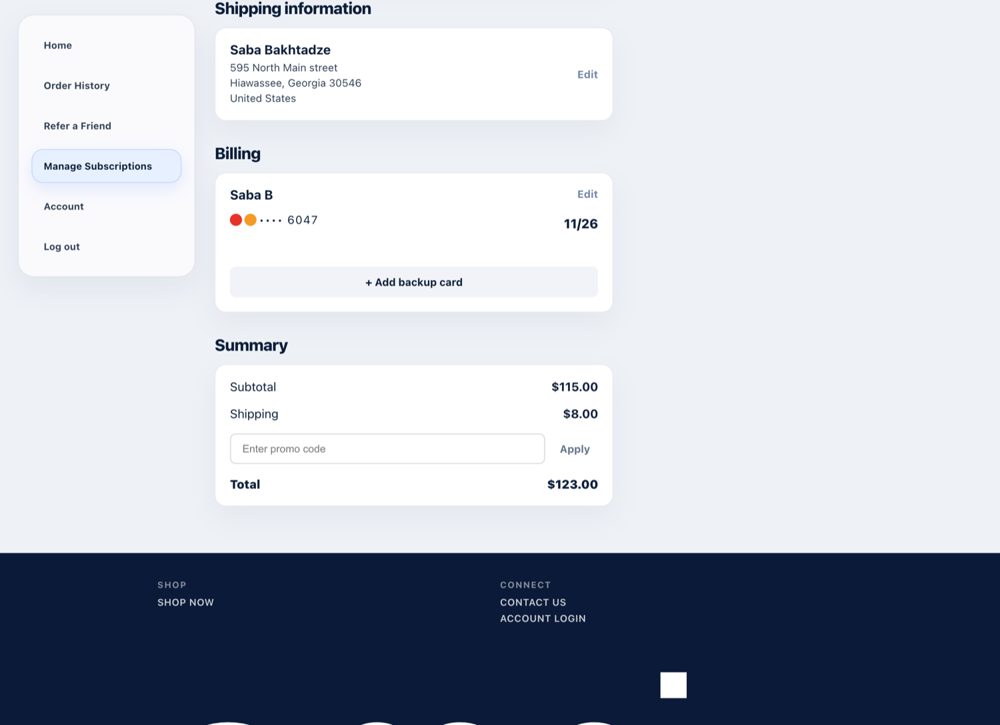
*The lower manage workspace: shipping, billing (with backup card), order summary + coupon,
and recommended products — every Edit/Add opens a real modal that saves.*

---

## 4. Paused state (manage + home)

- Title: **Paused**; subcopy "resumes {date}. Resume anytime."
- Action row: **Resume subscription** (primary) · Update shipping · Update payment · Cancel.
- Product card: **Paused** badge (muted, not green) + "Resumes {date}".
- **Resume subscription** → immediately returns that subscription to `active`, clears the
  pause, shows a toast, next order reschedules. (A confirm modal is optional here since
  resuming is non-destructive.)
- No "Order now"/"Skip" while paused (nothing is scheduled to ship).

---

## 5. Pause flow

Entry points: Manage "Pause", and the Cancel flow "Pause" save option.

1. Choose pause length: 4 / 8 / 12 weeks (cancel-flow variant also offers 2 weeks / custom).
2. Confirm → subscription becomes `paused`, `resumeDate` computed.
3. Styled confirmation: "Paused — resumes {date}. Resume anytime from the portal."
4. Only that subscription is paused (R2).

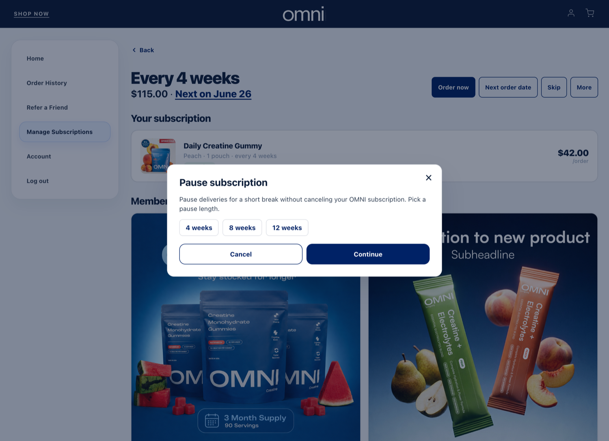
*Pause flow: pick a length, confirm, subscription moves to `paused` with a computed resume date.*

---

## 6. Cancellation flow  *(fixes Levani #1 and #2)*

This is the most important retention surface. Full step order:

```
Cancel intro (value reminder / skip-next offer)
   → Reason select          (each reason is DISTINCT — R-fix below)
   → Save page              (reason-specific retention offer; SAVE button highlighted — R3)
   → [optional branch]      (Skip / Pause / Cadence / Savings / Product swap — each ends "Saved")
   → Rescue page            (last retention offer; recommended action highlighted)
   → FINAL CONFIRMATION      (⚠️ required — "Cancel subscription" vs "Contact support")
   → Cancelled success screen
```

### Fixes required (from feedback)

- **#1 — Missing final confirmation step.** There must be an explicit final step where the
  customer confirms cancellation (destructive button) or backs out. Cancellation must
  **never** complete in one click from a reason. The reference build's `Final choice` step
  is the model.
- **#2 — Every reason must render its OWN content.** The current build shows the same
  save/reason content for every reason selected. Each reason maps to a **unique**
  headline, body, sub-reasons, retention cards, and CTA set. Selecting "Too expensive"
  shows the savings offer; "I'm stocked up" shows skip/slow-cadence; "Flavor not a fit"
  shows a product swap; etc. If two reasons show identical content, it's a bug.
- **R3 applied here:** on the save page and rescue page, the **retention/save action is the
  primary highlighted button**; "Review final step" / "Continue to final cancellation" is a
  small de-emphasized text link. The customer's eye should land on *staying*, not leaving.
- **R2 applied here:** cancelling cancels **only the selected subscription**. Do not loop
  over and cancel all of the customer's subscriptions.

### Reason → retention mapping (each distinct)

| Reason | Retention offer on save page |
|--------|------------------------------|
| Haven't seen results / hard to stay consistent | Consistency/habit plan, move to 8 weeks |
| I'm stocked up | Skip next order, move to 8/12 weeks, pause |
| Too expensive | Apply 50% off next 3 orders, skip + keep offer |
| Just wanted to try once / no longer need it | Skip, pause, slow cadence |
| Flavor/texture not a fit | Swap flavor or switch to stick packs |
| Too much sugar | Switch to sugar-free electrolyte stick packs |
| Digestion | Gentler routine, switch product, contact support |
| Ships too fast | Move next date out, 8/12 weeks, skip |
| Product/packaging issue | Route to support (with photo + lot # fields), pause |
| Found an alternative | Comparison + savings offer |
| Trouble editing | Show portal controls, contact support |
| Other | Free-text note, flexible options |

Key screens in the flow:

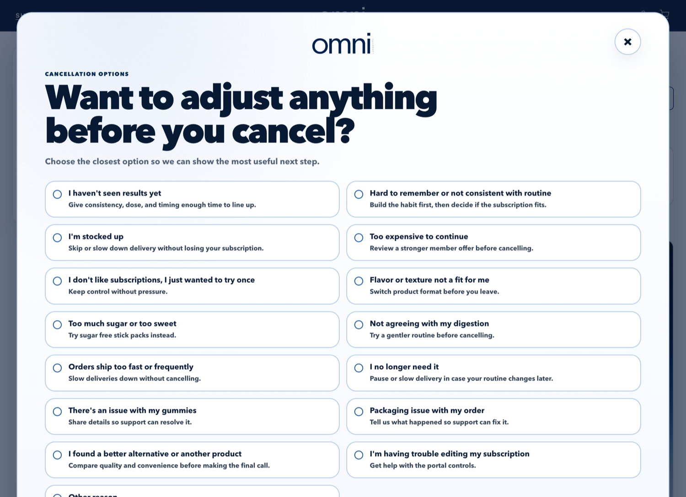
*Reason select. Each reason must lead to its **own** distinct save content (fixes #2).*

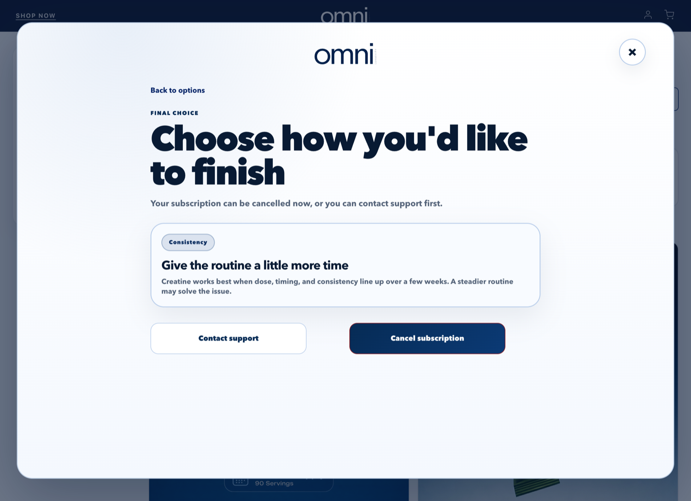
*Required final confirmation step (fixes #1): destructive "Cancel subscription" vs "Contact
support". Cancellation never completes in one click.*

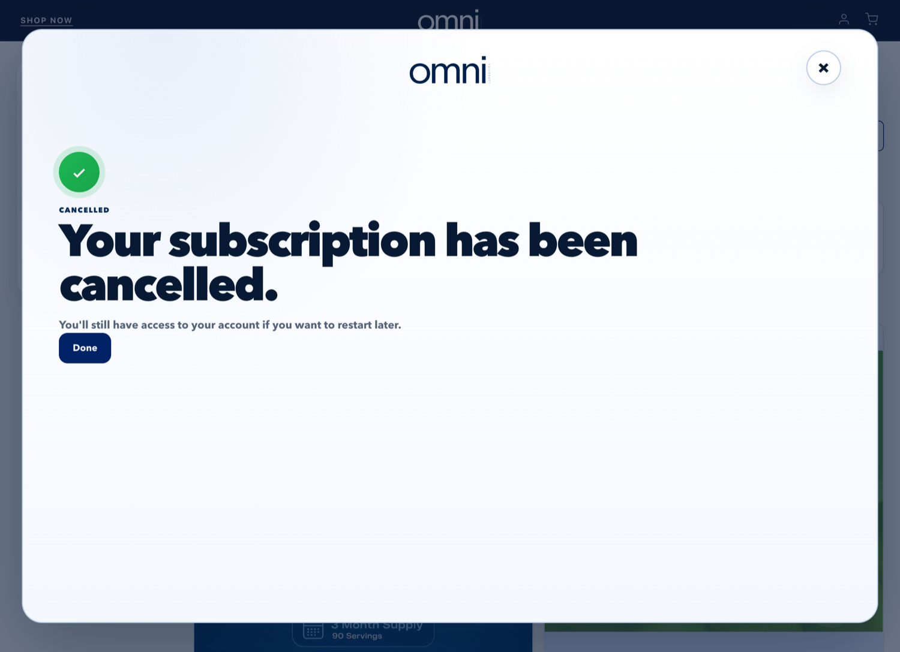
*Styled cancelled screen — the flow lands here; only the selected subscription is cancelled (R2).*

---

## 7. Offers  *(fixes Levani #3 and #4)*

Every offer follows R1: **card → confirmation modal (review) → confirm → styled "done"
screen → change applied.** Today most offer buttons open a modal but confirming does
nothing. That must be wired end to end.

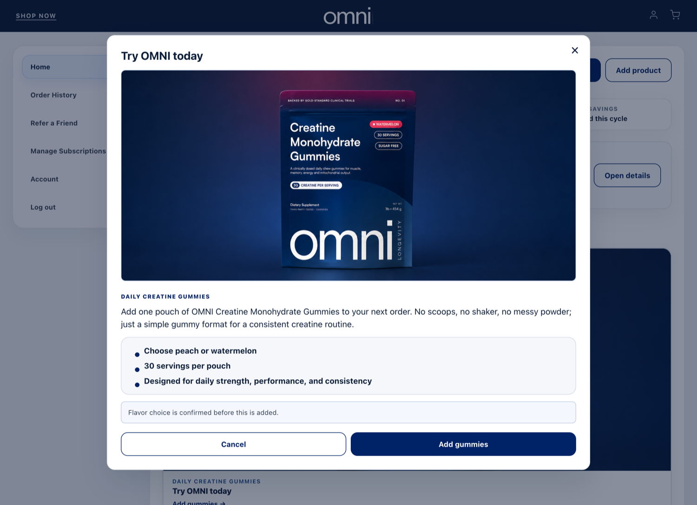
*Offer review modal: the customer sees exactly what will happen before confirming. Confirm
must apply the change and show a styled success — not silently close.*

### 7.1 Quarterly upgrade — segment-gated  *(fixes Levani #4 + the "quarterly idea")*

The quarterly offer's purpose is to move **light** subscribers to a better-value quarterly
cadence. It is **not** relevant to customers who already receive a large per-delivery
volume.

**Visibility rule:**
- Show the "Upgrade to Quarterly" offer to customers on a monthly cadence with **1 or 2
  pouches** per delivery.
- **Hide** it for customers already receiving **3 pouches** per delivery (or already on a
  quarterly plan) — they don't need it.

**Behavior when taken:** confirmation modal explaining the new billing/cadence → confirm →
the subscription's cadence updates to quarterly → styled "done" screen. Not a bare
notification.

### 7.2 Free gift — one-time, segment-specific  *(fixes Levani #3)*

- The free gift is a **one-time item added to the next order**, NOT a new recurring
  subscription line. Claiming it must never create a recurring product.
- **Which gift** is shown depends on the customer segment / history:
  - Customers who did **XYZ** → see e.g. **free Peach** gift.
  - Customers who did **XY** → see a **different** one-time gift.
- Claim flow: card → modal with two paths → confirm → styled success; the recurring plan
  is unchanged:
  - **Ship with my next order** — the one-time gift rides along on the next scheduled
    shipment.
  - **Send to a friend** — opens a shipping-address form and sends the gift to that
    address instead.
- Once claimed, the offer is **locked** (can't be re-claimed) so it stays a one-time gift.
- Full behavior of this flow is documented in **§3.1**.

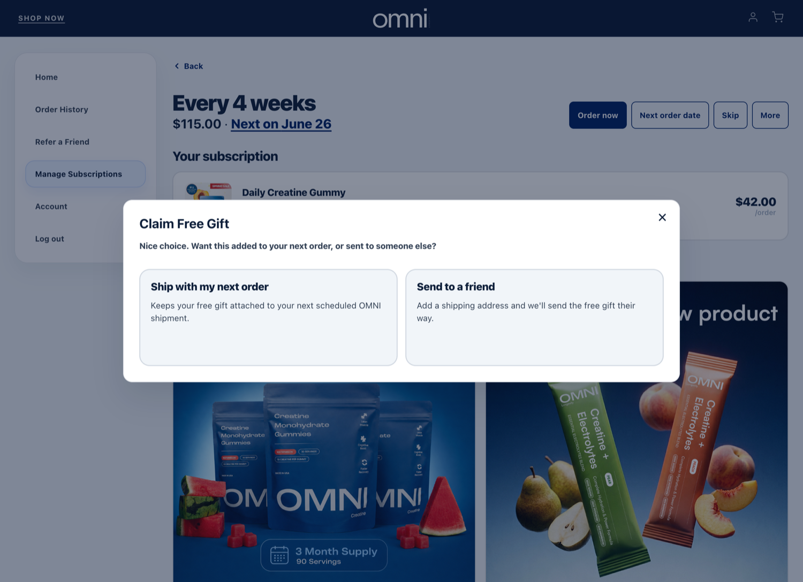
*The free gift is a one-time item with two paths (self / friend) — never a recurring
subscription line (fixes #3).*

### 7.3 Other offers (stack, add electrolytes, swap flavor, add gummies)

Each: card → review modal → confirm → applied to the **next order** (one-time) or to the
**subscription** (recurring) as stated in the offer copy → styled success. Be explicit in
the modal about which one it is, so it's never ambiguous like the gift bug.

---

## 8. Restart / reactivation flow (inactive → active)

Entry points: Home "Restart", Manage "Restart", inactive offer cards, callouts on Order
History / Refer a Friend.

Steps: **Product → Flavor → Cadence → Review → Confirm → "You're back" success screen.**

- Nothing ships until the Review step is confirmed (say so on each step).
- Confirming sets **that** subscription to `active` with the chosen product/flavor/cadence.
- The success screen is styled (green check, "You're back", product summary, perks, "Back
  to portal") — the customer should feel good about returning, not just get a toast.
- R2: reactivation activates **only the one** subscription, not all.

The four steps, then the styled success screen:

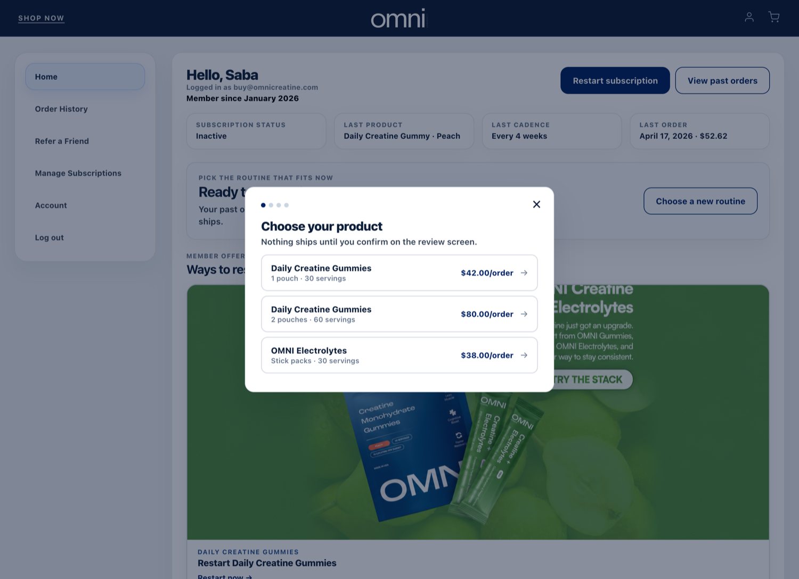
*Step 1 — product.*

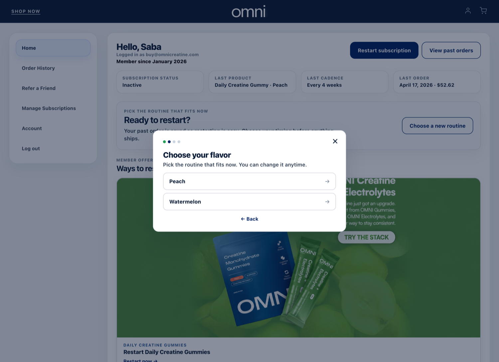
*Step 2 — flavor.*

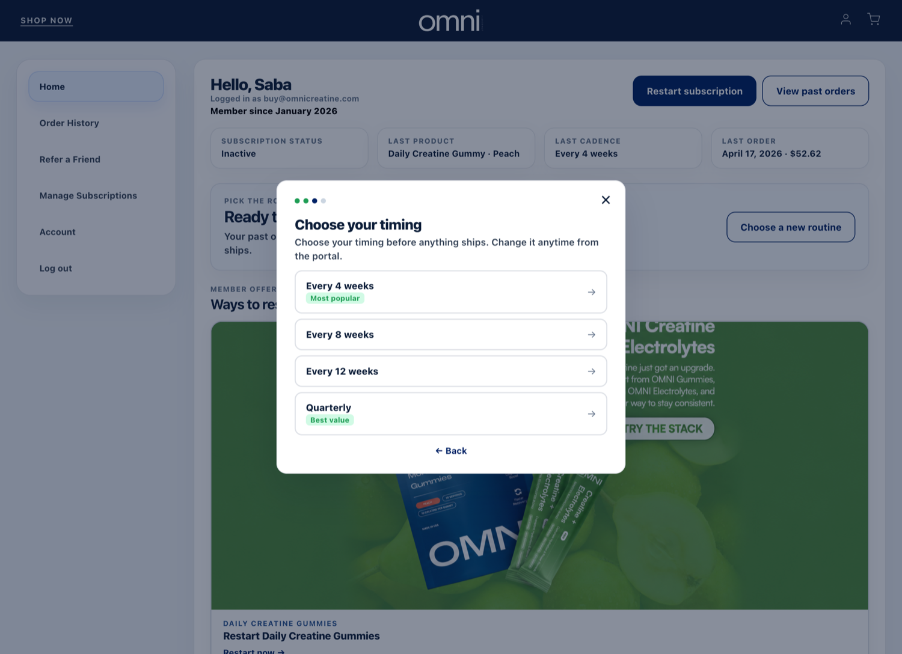
*Step 3 — cadence.*

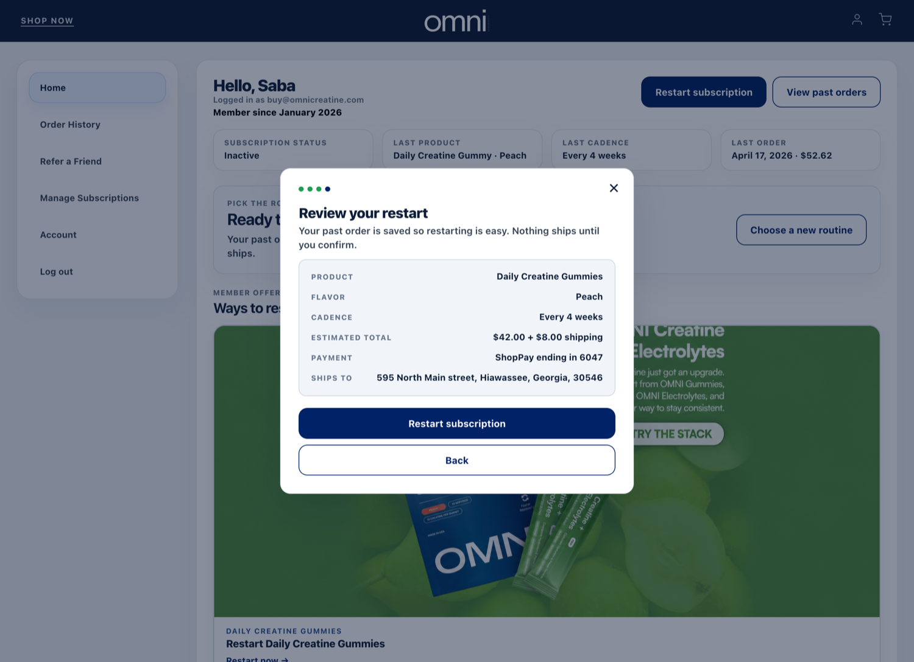
*Step 4 — review (nothing ships until this is confirmed).*

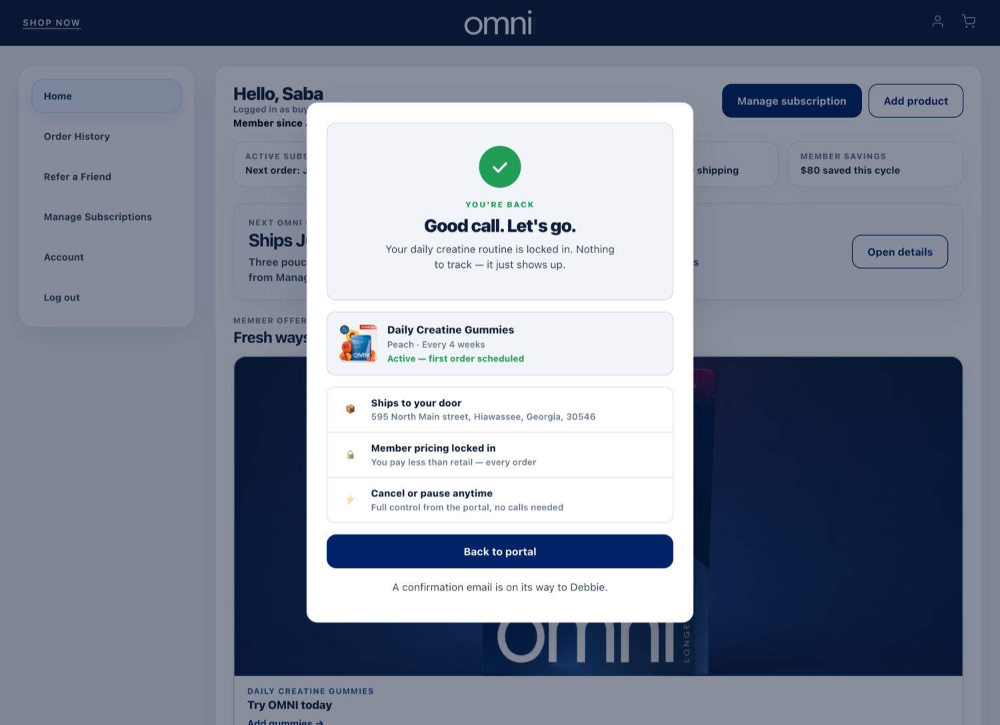
*Success: "You're back" — product summary, shipping/pricing perks, single button back to the portal.*

---

## 9. Order History

- Lists past orders (number, date, status, product, total) with "View details".
- When `inactive`: show a restart callout above the list ("Want to restart your OMNI
  routine?" + Restart button → §8).
- "View details" opens an order detail modal/screen (not a dead button).

---

## 10. Refer a Friend

- Eligibility form (name, email, phone) → submit → confirmation of submission.
- When `inactive`: show a notice that referral rewards may require an active account +
  a Restart button (§8).
- "Review status" opens the referral status view.

---

## 11. Account

- Shows detail cards: **Name**, **Email**, **Shipping address**, **Payment method**.
- Each card has **Edit** → opens the matching edit modal (`Edit name` / `Edit email` /
  `Edit shipping address` / `Edit payment method`) → save → the card reflects the change.
- No dead edit buttons — every Edit must open a working form and persist.

---

## 12. Miscellaneous flows (don't miss these)

Small surfaces that still need real behavior:

| Trigger | Location | Behavior |
|--------|----------|----------|
| **Add product / Add new subscription** | Home (active) | Opens product selection → confirm → adds a **new, separate** subscription (respects R2 — it's its own record). |
| **Cancel intro — "Skip next order"** | Start of cancel flow | Offers to skip the next order *before* entering the reason list; taking it skips and exits the flow (retention). |
| **Order details** | Order History | "View details" opens the order's detail view (items, totals, fulfillment) — not a dead button. |
| **Log out** | Nav | Confirms and ends the session. |
| **Refer a Friend — Review status** | Refer page | Opens the referral status view. |

> **Multiple subscriptions (R2 restated):** the data model must key everything by
> `subscriptionId`. "Add product" creates a second subscription; cancelling/pausing/
> reactivating one must leave the others untouched. This is the single biggest data bug in
> the current build and must be fixed at the model level, not per-screen.

---

## 13. Confirmation / success pattern (styling contract)

Reuse one consistent, styled success component across restart, cancel, pause, offers, and
gift claims:

- Circular status icon (green check for positive, neutral for cancel).
- Kicker (e.g. "You're back", "Paused", "Cancelled", "Done").
- One-line headline + short supporting line.
- Summary of what changed (product / date / gift).
- Single primary button back to the relevant page.

Every flow **must** land on this screen. A flow that ends on a silent toast or just closes
the modal is incomplete.

---

## 14. Checklist to consider a flow "done"

- [ ] The button changes real state (R1).
- [ ] It ends on the styled confirmation screen (§13).
- [ ] It touches only the selected subscription (R2).
- [ ] If it's a keep-vs-leave choice, the "stay" button is highlighted (R3).
- [ ] The page reflects the new state after returning (R4).
- [ ] Offers/gifts respect their segment rule and one-time vs recurring distinction (R5, §7).
- [ ] Cancellation has distinct per-reason content and a final confirmation step (§6).

---

*Reference implementation (all of the above working): https://omni-customer-portal-delta.vercel.app*
